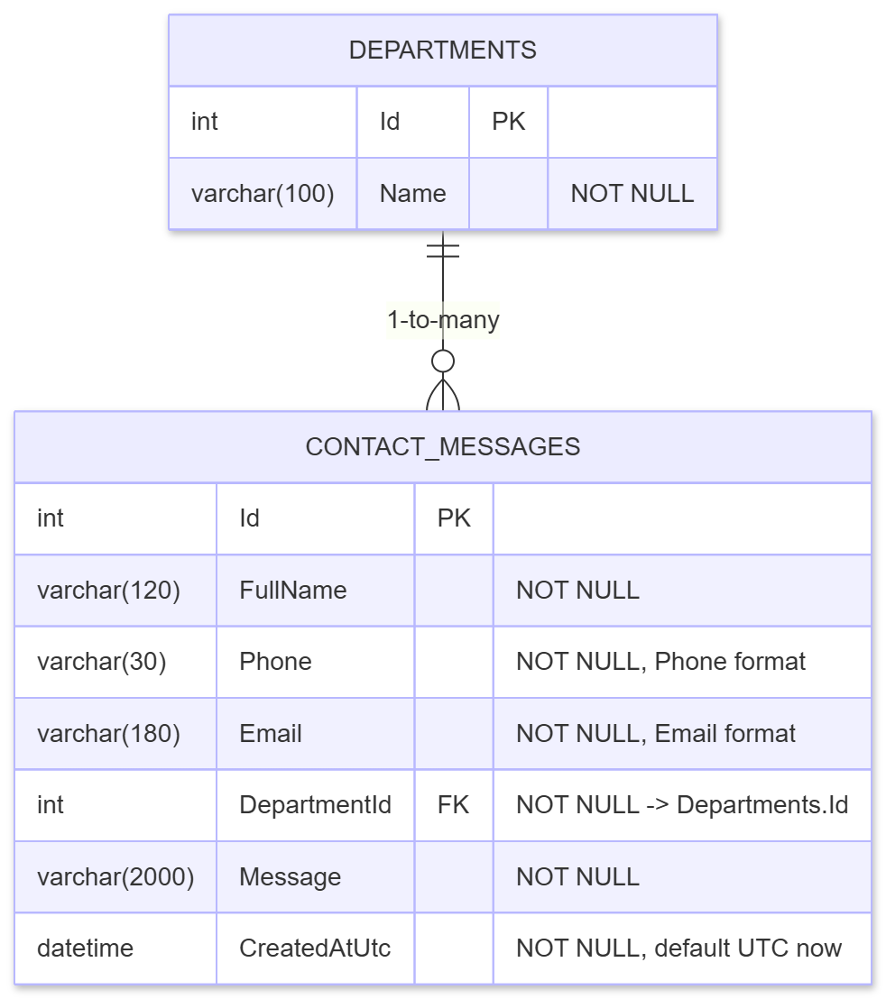
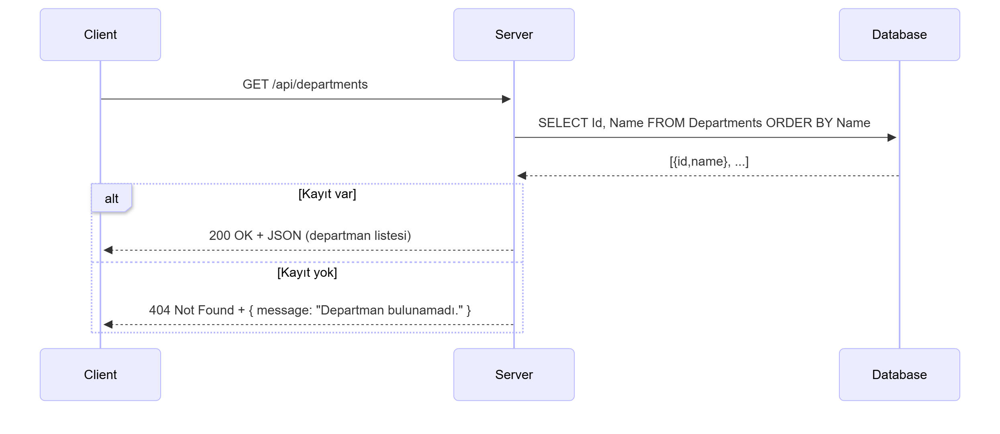

# ASP.NET Contact Form - Dockerized Version

Bu proje, kullanıcıların web üzerinden iletişim formu aracılığıyla mesaj göndermesini sağlayan bir **ASP.NET Core MVC** uygulamasıdır.  
Uygulama, **Microsoft SQL Server (Docker)** üzerinde çalışır ve container ortamında otomatik olarak başlatılabilir.

---

## 1. Proje Tanıtımı

Bu uygulama, gelen mesajları veritabanında saklayan basit ama genişletilebilir bir iletişim formu sistemidir.  
Amaç, **Docker kullanarak** kolayca kurulabilir ve her ortamda aynı şekilde çalışan bir ASP.NET uygulaması oluşturmak.

### Özellikler
- Departman seçimi (örnek: Muhasebe, Teknik Destek, İnsan Kaynakları)
- SQL Server üzerinde otomatik migration ve seed verileri
- RESTful API endpoint'leri (`/api/contactmessages`, `/api/departments`)
- Docker Compose ile tek komutla ayağa kaldırılabilen yapı

---

## 2. Kullanılan Teknolojiler


---

## 3. Diyagramlar

### Kullanıcı Arayüzü


### Veritabanı Diyagramı


### Departman İlişkisi


### Dataset Akışı


---

## 4. Kurulum ve Çalıştırma

### Gereksinimler
- Docker ve Docker Compose kurulu olmalıdır.  
- İnternet bağlantısı gereklidir (SQL Server imajı indirilecektir).  

---

### Adım 1: Depoyu Klonlayın
```bash
git clone https://github.com/reecepyuksel/contact-form-asp.net
cd contact-form-asp.net
```

---

### Adım 2: `.env` Dosyasını Oluşturun
Proje dizininde `.env` adında bir dosya oluşturun ve aşağıdaki bilgileri ekleyin:

```env
DB_SERVER=mssql,1433
DB_NAME=aspnet_contact_form
DB_USER=SA
DB_PASS=1234
```

> Parolayı güvenli bir şekilde değiştirmeniz önerilir.

---

### Adım 3: Docker Compose ile Başlatın
Aşağıdaki komut, hem SQL Server’ı hem de ASP.NET uygulamasını başlatır:

```bash
docker compose up -d --build
```

Başlatma tamamlandığında uygulamaya şu adresten erişebilirsiniz:  
[http://localhost:8080](http://localhost:8080)

---

### Adım 4: Servis Durumunu Kontrol Etme
Servislerin durumunu görmek için:
```bash
docker ps
```

Log’ları görmek için:
```bash
docker logs aspnet-contact-form
```

Durdurmak için:
```bash
docker compose down
```

---


## 5. Proje Yapısı

```
project-root/
│
├── aspnet-contact-form/
│   ├── aspnet-contact-form.sln
│   ├── Dockerfile
│   └── aspnet-contact-form/
│       ├── Controllers/
│       ├── Data/
│       ├── Models/
│       ├── Migrations/
│       ├── Views/
│       ├── Program.cs
│       ├── appsettings.json
│       └── .env
│
├── docker-compose.yml
├── images/
│   ├── databasediagram.png
│   ├── diagram_dataset.png
│   ├── diagram_dep.png
│   └── userinterface.jpg
└── README.md
```
